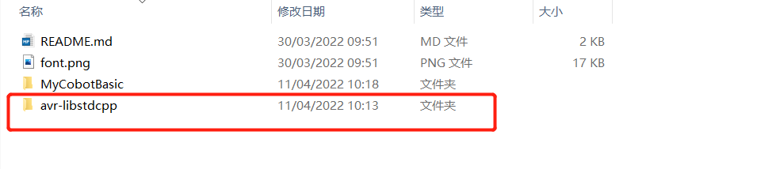

# myCobot: Arduino

Please review [root-level README](../) first!

# M5 Stack Basic

以上程序只适用于myCobot底座上的M5 Basic控制器进行使用
This robot only deals with M5 Basic Board only!

M5Stack Basic 的基本应用与烧录可以参考以下链接
Please refer to the following link for the basic application and programming of
M5Stack:

- <https://docs.m5stack.com/#/zh_CN/core/basic> (Chinese)
- <https://docs.m5stack.com/#/en/core/basic> (English)

# Library & Example 

To start, please see `MycobotBasic.h` and `MycobotBasic.cpp`

## Update 

- Can only be used with AtomMain3.1 in myStudio2.2
https://github.com/elephantrobotics/myStudio/releases

- 本次更新修复了大多数角度控制函数的处理方式

# FAQ

如果您使用我们的库，并且需要运行历程,但是编译器提示mycobot_24px.h文件报错，那请您先修改语言配置  
* windows  
> 打开：" C:\Users\Admin\Documents\Arduino\libraries\M5Stack\src\utility/ln_eSPI_Setup.h "  
> 取消最后一句代码的注释,如图：

# 底部basic库
使用底部basic库您可以在Arduino下自由开发，控制我们公司的机械臂。 
## 编译前的修改
*导入库文件，如果您的机械臂是myCobot280-Arduino，请检查开发板是否为Mega2560或者Uno，如果是： 
1. 请将**MyCobotBasic\lib\avr-libstdcpp**放到**C:\Users\User\Documents\Arduino\libraries**下: 
 
 
2. 头文件替换，使用不同机型时，请使用各自案例目录下的"ParameterList.h"文件替换"MyCobotBasic\ParameterList.h"文件，具体文件位置如下图所示：
 
 
## 部分案例介绍：
1. 目前不同机型都有角度、坐标、夹爪控制，MyCobot320支持自适应夹爪与电动夹爪控制。 
2. miniRobot： 
MyCobot280、320m5、MechArm270-M5使用案例，可以进行零位校准、拖动示教、通讯等（在此基础上，使用RoboFlow、python、myblockly等控制机械臂）、信息获取（获取舵机 atom连接状态、以及basic、atom固件版本）。 
3. Transponder： 
myCobot280-Arduino uno和Mega2560开发板使用案例，功能主要是通讯，在此基础上，使用RoboFlow、python、myblockly等控制机械臂，进行io控制。 
4. MyPalletizerRoboFlow： 
MyPalletizer260使用案例，可以进行零位校准、拖动示教、通讯（在此基础上，使用RoboFlow、python、myblockly等控制机械臂）、信息获取（获取舵机 atom连接状态、以及basic、atom固件版本）。 

注意：Arduino环境配置及案例编译可以看我们的gitbook文档（https://docs.elephantrobotics.com/docs/gitbook/10-ArduinoEnv/） 和哔哩哔哩上的视频 （https://www.bilibili.com/video/BV1X3411W7Sn/）。
